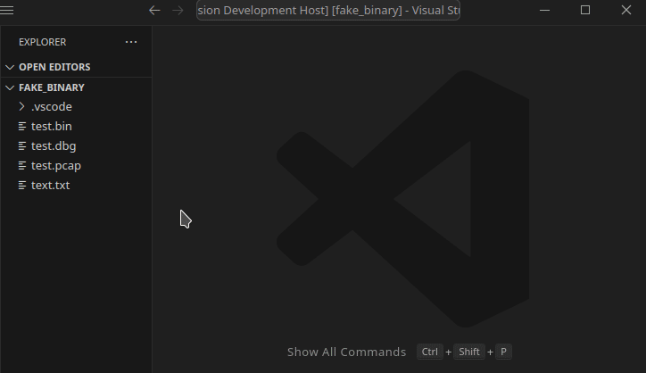

# Shell Preview

VS Code extension for viewing the output of a custom shell command on the active file.



## Configuration

Configure your VS Code workspace or user settings
```
{
    // Command definitions
    "shell-preview.commands": {
        "xxd": "xxd ${file}",
        "hexdump": "hexdump ${file}",
        "tshark": "tshark -r ${file}",
        "tcpdump": "tcpdump -r ${file}"
    },

    // Associate file names with command definitions.
    // If no association is found the user is prompted to choose on available command.
    "shell-preview.fileAssociations": {
        "*.bin": "xxd",
        "*.pcap": "tcpdump"
    }
}
```

## Usage

Open the file to process, then in the command palette (`Ctrl+Shift+P` or
`View > Command Palette...`) run `Shell Preview: Run Command and Open Output`.


## License

Licensed under either of

 * Apache License, Version 2.0
   ([LICENSE-APACHE](LICENSE-APACHE) or http://www.apache.org/licenses/LICENSE-2.0)
 * MIT license
   ([LICENSE-MIT](LICENSE-MIT) or http://opensource.org/licenses/MIT)

at your option.

## Contribution

Feel free to open a Github issue or a pull request.
I will try my best to address them, but cannot guarantee to respond or accept all issues.

Unless you explicitly state otherwise, any contribution intentionally submitted
for inclusion in the work by you, as defined in the Apache-2.0 license, shall be
dual licensed as above, without any additional terms or conditions.
